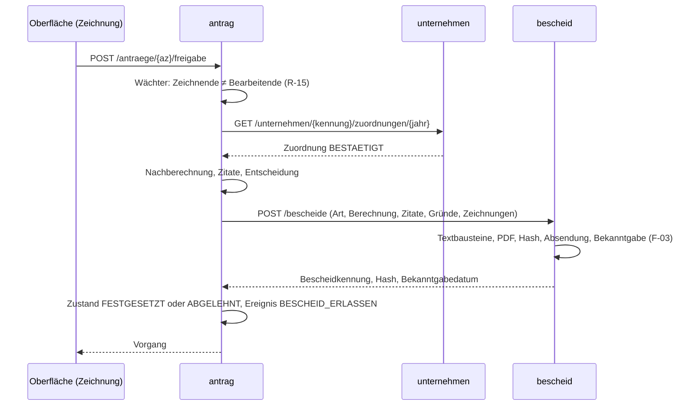

# Architektur und Bauplan

Referenzverfahren `stromentlastung` · Fassung 1.0 · gehört zum [Fachkonzept](fachkonzept.md)

## 1 Schnitt

Das Referenzverfahren besteht aus sieben Repositories in einem Arbeitsbereich. Vier Dienste tragen die Fachlichkeit, je einer die Oberfläche und die Ende-zu-Ende-Tests, und dieses Plattform-Repository hält alles, was keinem Dienst gehört: Fachkonzept, Architektur, Identitätsanbieter, Gateway-Konfiguration und den Fahrstand.

| Repository | Verantwortung | Technik | Erreichbar |
| --- | --- | --- | --- |
| `stromentlastung-platform` | Fachkonzept, Architektur, Compose, Keycloak-Realm, Gateway, Fahrstand | Docker Compose, nginx, Bash | Keycloak `localhost:9091`, Gateway `localhost:8090` |
| `stromentlastung-unternehmen` | Unternehmensregister: Stammdaten, Hauptzollämter und Zuständigkeit, Zuordnung nach § 15 StromStV | Spring Boot 3.4.5, Java 17, H2, Flyway | `localhost:8091/api/unternehmen` |
| `stromentlastung-antrag` | Vorgang: Antrag, Rechenkern, Fristen, Zustandsmaschine, Nachweise, Vorgangsprotokoll, Orchestrierung der Festsetzung | dito | `localhost:8092/api/antraege` |
| `stromentlastung-bescheid` | Bescheide: Textbausteine, PDF, Hash, Bekanntgabe, Postfach | dito, OpenPDF | `localhost:8093/api/bescheide` |
| `stromentlastung-zahlung` | Erhebung: Auszahlung, Rückforderung, Säumniszuschläge, Rückzahlung | dito | `localhost:8094/api/zahlungen` |
| `stromentlastung-ui` | Antragsportal und Fachanwendung in einer Oberfläche | Angular 19, Transloco (Deutsch führend), Tailwind 4, keycloak-js, generierte Clients | `localhost:4202` |
| `stromentlastung-e2e` | Ende-zu-Ende-Tests gegen den laufenden Stapel, Barrierefreiheitsprüfung | Playwright, axe-core | — |

Der Schnitt folgt den fachlichen Zuständigkeiten des Fachkonzepts. Der **Vorgang** besitzt die Zustandsmaschine, und zwar an genau einer Stelle; alle anderen Dienste sind ihm gegenüber Zulieferer. Der **Bescheid**-Dienst ist ein Dokumentendienst, der ausschließlich Daten erhält: Beträge, Mengen, Gründe und die Rechtsgrundlagen-Zitate kommen fertig aus dem Rechenkern des Vorgangs (Fachkonzept B-03), der Bescheid-Dienst setzt sie in Textbausteine und erzeugt die PDF-Datei. Die **Erhebung** ist die Kasse: sie kennt Zahlungen, Fälligkeiten und Säumnis, aber keinen Antragsinhalt. Das **Unternehmensregister** wird von den anderen befragt, befragt aber niemanden.

Zwischen den Diensten gibt es keine gemeinsame Bibliothek. Die Sicherheitskonfiguration und das Fehlerformat sind in jedem Dienst bewusst dupliziert (rund achtzig Zeilen), damit jedes Repository für sich baubar, testbar und austauschbar bleibt. Dienste referenzieren einander über fachliche Schlüssel, nie über Datenbankkennungen: die Unternehmenskennung (`U-001`), das Aktenzeichen (`HZA-N-9b-2025-000001`) und die Bescheidkennung.

## 2 Gateway

Der Browser spricht mit genau einem Ursprung. Im Entwicklungsbetrieb ist das der Angular-Entwicklungsserver, dessen Proxy die Präfixe `/api/unternehmen`, `/api/antraege`, `/api/bescheide` und `/api/zahlungen` auf die vier Dienste verteilt. Im Containerbetrieb übernimmt nginx dieselbe Verteilung auf Port 8090 und liefert die gebaute Oberfläche aus. Ein eigener Gateway-Dienst existiert nicht: Die Verteilung nach Pfadpräfix ist Konfiguration, kein Code (Entscheidung A-01).

## 3 Identität und Rollen

Keycloak stellt den Realm `stromentlastung` mit dem öffentlichen Client `stromentlastung-web` (Authorization Code mit PKCE) bereit. Die vier Rollen des Fachkonzepts sind Realm-Rollen: `antragsteller`, `sachbearbeitung`, `zeichnung`, `pruefdienst`. Zwei Nutzerattribute wandern als Claims in das Zugriffstoken: `unternehmen` trägt die Unternehmenskennung eines Antragstellerkontos, `dienststelle` die Kennung des Hauptzollamts (`HZA-N`, `HZA-S`) eines Beschäftigtenkontos.

Jeder Dienst ist ein zustandsloser Resource Server. Er liest die Rollen aus `realm_access.roles` und stellt die Claims über eine kleine Klasse `CurrentUser` bereit; die Autorisierung steht als `@PreAuthorize` an den Endpunkten, die Mandantentrennung (Fachkonzept Kap. 10) in den Diensten. Ruft ein Dienst einen anderen, gibt er das Zugriffstoken des Aufrufers weiter (Entscheidung A-06); es gibt keine technischen Nutzer.

Der Realm wird beim Start importiert. Alle Passwörter lauten `stromentlastung` und sind eingecheckt; sie sind kein Geheimnis, sondern Saatdaten.

## 4 Daten

Jeder Dienst besitzt eine eigene H2-Datenbank. Auf dem Entwicklungsrechner läuft sie im Dateimodus unter `./data/` des jeweiligen Repositories, damit ein Neustart eines einzelnen Dienstes keinen Zustand verliert, den die anderen Dienste noch kennen (Entscheidung A-02); in den Tests läuft sie im Speicher. Das Schema gehört Flyway: `V1__schema.sql` legt die Tabellen an, `V2__saat.sql` spielt die Saatdaten-Geschichten aus Fachkonzept Kap. 12 ein, spätere Migrationen werden angehängt und nie geändert. JPA validiert das Schema nur (`ddl-auto: validate`).

Die Saatdaten der vier Dienste erzählen dieselben Geschichten und müssen deshalb dieselben Schlüssel verwenden. Die Tabelle ist der Vertrag:

| Kennung | Unternehmen | Abschnitt | Postleitzahl, Ort | Dienststelle | Konto |
| --- | --- | --- | --- | --- | --- |
| `U-001` | Nordfeld Metallbau GmbH | D | 24103 Kiel | HZA-N | `nordfeld@stromentlastung.dev` |
| `U-002` | Hansa Bau AG | F | 20457 Hamburg | HZA-N | `hansa-bau@stromentlastung.dev` |
| `U-003` | Küstenmühle Brot GmbH | D | 25746 Heide | HZA-N | `kuestenmuehle@stromentlastung.dev` |
| `U-004` | Lübecker Glaswerk GmbH | D | 23552 Lübeck | HZA-N | `glaswerk@stromentlastung.dev` |
| `U-005` | Weserland Kunststoffe GmbH | D | 28195 Bremen | HZA-N | `weserland@stromentlastung.dev` |
| `U-006` | Elbtal Maschinenbau GmbH | D | 21079 Hamburg | HZA-N | `elbtal@stromentlastung.dev` |
| `U-007` | Ostsee Werft GmbH | D | 18055 Rostock | HZA-N | `ostsee-werft@stromentlastung.dev` |
| `U-008` | Alpenland Solarmodule GmbH | D | 83022 Rosenheim | HZA-S | `alpenland@stromentlastung.dev` |
| `U-009` | Hafenkontor Handel GmbH | G (beantragt D) | 20095 Hamburg | HZA-N | `hafenkontor@stromentlastung.dev` |
| `U-010` | Marschhof Agrar KG | A | 25836 Garding | HZA-N | `marschhof@stromentlastung.dev` |
| `U-011` | Schwarzwald Papier GmbH | D | 79098 Freiburg | HZA-S | `schwarzwald-papier@stromentlastung.dev` |
| `U-012` | Dithmarscher Fischwerk GmbH | D | 25761 Büsum | HZA-N | `fischwerk@stromentlastung.dev` |
| `U-013` | Wattenmeer Ziegelei GmbH | D | 26506 Norden | HZA-N | `ziegelei@stromentlastung.dev` |

Beschäftigte: Aymen Mastouri (`mastouri@stromentlastung.dev`, Sachbearbeitung und Zeichnung, HZA-N), Sabine Wagner (`wagner@stromentlastung.dev`, Sachbearbeitung, HZA-N), Murat Demir (`demir@stromentlastung.dev`, Sachbearbeitung, HZA-N), Lars Becker (`becker@stromentlastung.dev`, Zeichnung, HZA-N), Petra Roth (`roth@stromentlastung.dev`, Prüfdienst, HZA-N), Jonas Keller (`keller@stromentlastung.dev`, Sachbearbeitung, HZA-S), Anna Vogt (`vogt@stromentlastung.dev`, Zeichnung, HZA-S).

Aktenzeichen der Saat: `HZA-N-9b-<Entnahmejahr>-<Nr>` in der Reihenfolge der Geschichten S-01 bis S-13, Dienststelle Süd für S-08 und S-11. Beträge werden in allen Diensten in Cent als `BIGINT` geführt, Mengen in Kilowattstunden als `BIGINT`, Datumsangaben ohne Zeitanteil als `DATE`, Zeitpunkte als `TIMESTAMP WITH TIME ZONE`.

Jeder Dienst besitzt eine `Clock`. Die Eigenschaft `stromentlastung.heute` (ISO-Datum) friert das „Heute“ des Dienstes ein; ohne sie gilt die Systemuhr. Damit sind Fristläufe und Säumnisberechnungen reproduzierbar (Fachkonzept Kap. 10, Stichtagsfähigkeit).

## 5 Abläufe zwischen den Diensten

Der Vorgang orchestriert. Die Festsetzung ist der längste Weg:

Die Änderung nach Prüfung läuft analog: Der Vorgang lässt den Änderungsbescheid erzeugen, meldet der Erhebung die Rückforderung mit Fälligkeit (F-05, einen Monat nach Bekanntgabe) und wechselt nach `RUECKFORDERUNG_OFFEN`. Bei Erfassung der Rückzahlung meldet der Vorgang die Zahlung an die Erhebung, die die aufgelaufenen Säumniszuschläge festsetzt und den Deckungsstand zurückgibt; ist alles gedeckt, wechselt der Vorgang nach `BEGLICHEN`. Die Auszahlung ist der einfache Fall: der Vorgang meldet sie der Erhebung und wechselt nach `AUSGEZAHLT`.

Ist ein Zulieferer nicht erreichbar, bleibt der Vorgang in seinem Zustand und antwortet mit dem Regelcode `DIENST_NICHT_ERREICHBAR` (503). Es gibt keine Kompensation und keine Nachrichtenwarteschlange (Entscheidung A-08).

## 6 Fehler und Regelcodes

Alle Dienste antworten bei Regelverletzungen mit `409 Conflict` und dem Körper `{"code": "<REGELCODE>", "message": "<Diagnose für Entwickler>"}`, bei Unbekanntem mit `404` und `code: NOT_FOUND`, bei Eingabefehlern mit `400` und einer Feldzuordnung. Die Regelcodes sind die des Fachkonzepts; die Oberfläche übersetzt sie über Transloco. Die `message` ist Diagnose, nie Anzeigetext.

## 7 Bring-up

**Entwicklungsbetrieb** (Regelfall): `scripts/stromentlastung.sh start` startet Keycloak über Compose, die vier Dienste über den Maven-Wrapper mit JDK 17 und die Oberfläche über den Angular-Entwicklungsserver; `status`, `stop` und `reset` (löscht die H2-Dateien, die nächste Startsequenz sät neu) gehören dazu. Der Fahrstand beendet nur Prozesse, deren Arbeitsverzeichnis im Arbeitsbereich liegt.

**Containerbetrieb**: `docker compose --profile full up --build` baut alle Dienste und die Oberfläche und stellt den Stapel hinter nginx auf Port 8090 bereit. Die Dienste erreichen Keycloak dann unter `http://keycloak:8080`, während die Token den öffentlichen Aussteller `http://localhost:9091` tragen; deshalb prüfen die Dienste den Aussteller getrennt vom Schlüsselabruf (`STROMENTLASTUNG_ISSUER`, `STROMENTLASTUNG_JWKS_URI`).

| Was | Port |
| --- | --- |
| Keycloak | 9091 |
| Gateway (nur Container) | 8090 |
| unternehmen | 8091 |
| antrag | 8092 |
| bescheid | 8093 |
| zahlung | 8094 |
| Oberfläche (Entwicklungsserver) | 4202 |

Die Ports sind so gewählt, dass BookNetwork (4201, 8088, 9090) daneben laufen kann.

## 8 Tests

Jeder Dienst prüft seinen Kern ohne Datenbank und ohne Uhr: Rechenkern (Sätze, Selbstbehalt, Rundung, Zitate), Fristen (Feiertage, Wochenendverschiebung, Monatsfristen), Zustandsmaschine (jeder Übergang und jeder Wächter), Säumnisberechnung (angefangene Monate, Schonfrist). Endpunkte werden mit `@WebMvcTest` und einem nachgestellten JWT geprüft, Migrationen durch den Start des Anwendungskontexts gegen H2 im Speicher. Die Ende-zu-Ende-Tests fahren den vollen Bogen mit echten Anmeldungen: Antrag bis Auszahlung, Änderung mit Rückforderung bis Begleichung, Zuordnungsentscheidung, Sprachwechsel und die Barrierefreiheitsprüfung jeder Ansicht mit axe.

## 9 Entscheidungen

**A-01 Kein Gateway-Dienst.** Pfadpräfix-Verteilung ist Konfiguration (Angular-Proxy, nginx). Ein Spring-Cloud-Gateway brächte ein achtes Repository ohne fachlichen Gegenwert.

**A-02 H2 im Dateimodus.** Ein Dienst darf neu starten, ohne dass die anderen ihn für amnesisch halten. `reset` löscht bewusst.

**A-03 Fachliche Schlüssel über Dienstgrenzen.** Unternehmenskennung, Aktenzeichen, Bescheidkennung. Datenbankkennungen bleiben im Dienst.

**A-04 Duplizierte Querschnittsklassen.** Sicherheitskonfiguration, `CurrentUser`, `ApiError` in jedem Dienst. Unabhängige Baubarkeit schlägt Wiederverwendung.

**A-05 Saat-Bescheide werden beim Start gerendert.** Flyway sät Bescheiddaten, nicht PDF-Bytes; der Bescheid-Dienst rendert beim Start fehlende PDF-Dateien und berechnet ihre Hashes.

**A-06 Token-Weitergabe.** Dienst-zu-Dienst-Aufrufe tragen das Zugriffstoken des Aufrufers; die Rolle wird am Ziel geprüft.

**A-07 Deutsch führend.** Oberfläche, Bescheide, Regelcodes-Übersetzungen und Dokumente sind deutsch; Englisch ist die zweite Oberflächensprache.

**A-08 Keine Kompensation.** Ein fehlgeschlagener Zuliefereraufruf lässt den Vorgang im alten Zustand; der Nutzer wiederholt.

**A-09 Bekanntgabefiktion mit Werktagsverschiebung.** Der vierte Tag nach Absendung wird nach § 108 Abs. 3 AO auf den nächsten Werktag verschoben (**Festlegung** entsprechend der Rechtsprechung zur Drei-Tage-Fiktion).
