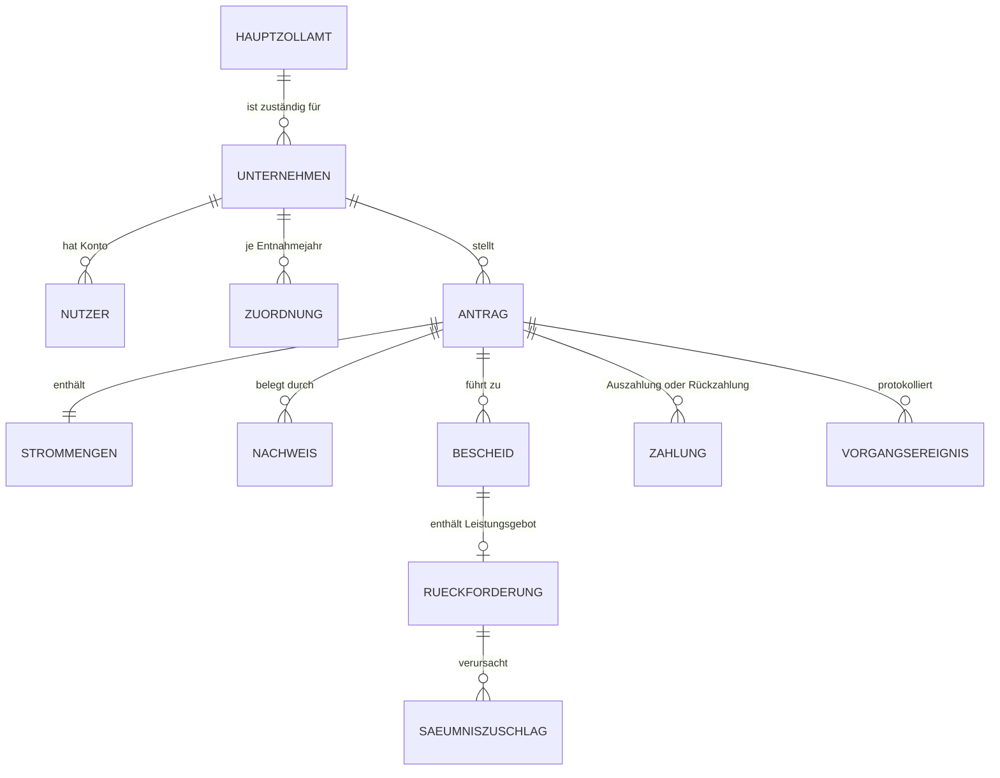
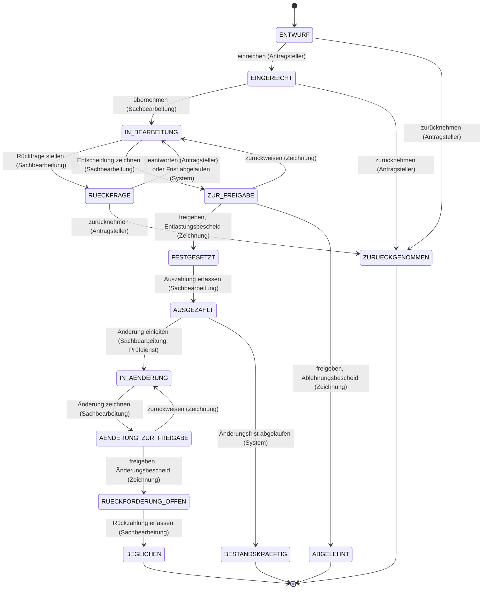

# Fachkonzept: Steuerentlastung für Unternehmen nach § 9b StromStG

Referenzverfahren `stromentlastung` (Arbeitstitel) · Fassung 1.0 · Rechtsstand 31. Dezember 2025

## 0 Zweck, Geltung und Lesart

Dieses Dokument beschreibt die fachlichen Anforderungen an ein Referenzverfahren, das die Steuerentlastung für Unternehmen des Produzierenden Gewerbes und der Land- und Forstwirtschaft nach § 9b Stromsteuergesetz (StromStG) Fachverfahren-typisch nachbildet. Es ist kein Verfahren der Zollverwaltung und bildet keines nach. Es ist ein bewusst verkürzter, in seinen Regeln aber belastbarer Ausschnitt, der als Demonstrations- und Testgegenstand dient. Die Anwendung trägt diesen Charakter in jeder Ansicht sichtbar: „Referenzverfahren – kein Echtbetrieb“.

**Rechtsstand.** Das Dokument beschreibt das Recht, wie es am 31. Dezember 2025 galt. Spätere Rechtsänderungen werden nicht stillschweigend eingearbeitet, sondern als Änderungsanforderung an das Verfahren eingebracht; Fachkonzept und Software ändern sich dann gemeinsam und nachvollziehbar.

**Quellenregel.** Jede fachliche Regel trägt ihre Fundstelle. Die Normtexte des StromStG, der StromStV und der AO wurden am 8. September 2026 von gesetze-im-internet.de abgerufen. Die Historie des Entlastungssatzes stammt aus der Begründung zu BT-Drs. 21/1866 und aus der Verkündung des Haushaltsfinanzierungsgesetzes 2024 (BGBl. 2023 I Nr. 412). Verwaltungspraxis (Vordrucke, Schwellenwerte, Fristauslegung) stammt von zoll.de. Wo das Recht eine Frage offenlässt, die das Verfahren entscheiden muss, ist die Entscheidung als **Festlegung** gekennzeichnet; sie ist damit als Verfahrensentscheidung erkennbar und nicht als Rechtsauslegung.

**Lesart.** R bezeichnet eine fachliche Regel, F eine Frist, B einen Bescheidinhalt, V eine bewusste Vereinfachung, S eine Saatdaten-Geschichte. Regelverletzungen liefert das Verfahren als Regelcode (etwa `ENTLASTUNG_UNTER_SELBSTBEHALT`); die Oberfläche übersetzt ihn. Das Backend liefert keine Anzeigetexte.

## 1 Gegenstand des Verfahrens

Strom, den ein Unternehmen aus dem Versorgungsnetz entnimmt, ist nach § 3 StromStG mit 20,50 Euro je Megawattstunde versteuert; die Steuer trägt das Unternehmen wirtschaftlich über den Strompreis. Unternehmen des Produzierenden Gewerbes und der Land- und Forstwirtschaft erhalten auf Antrag eine Entlastung für den Strom, den sie für betriebliche Zwecke entnommen haben (§ 9b Abs. 1 StromStG). Der Antrag ist beim zuständigen Hauptzollamt zu stellen; der Antragsteller macht alle für die Bemessung erforderlichen Angaben und berechnet die Entlastung selbst (§ 17b Abs. 1 Satz 1 und 2 StromStV). Das Hauptzollamt prüft, setzt die Entlastung fest und zahlt sie aus; die Vorschriften der Abgabenordnung über die Steuerfestsetzung gelten dafür sinngemäß, und auch die Ablehnung eines Antrags ergeht durch Bescheid (§ 155 Abs. 5 und Abs. 1 Satz 3 AO). Die Entlastung ist eine staatliche Beihilfe (§ 2a Abs. 3 StromStG); deshalb gelten beihilferechtliche Ausschlüsse. Seit dem 1. Januar 2025 ist der Antrag elektronisch zu übermitteln (§ 17b Abs. 1 Satz 4 StromStV).

Das Referenzverfahren ist dieser elektronische Kanal und zugleich die Fachanwendung des Hauptzollamts. Es vereint zwei Perspektiven in einer Anwendung: das **Antragsportal**, in dem ein Unternehmen seine Stammdaten pflegt, die Zuordnung zum Produzierenden Gewerbe beantragt, Anträge stellt, Rückfragen beantwortet und seine Bescheide empfängt; und die **Fachanwendung**, in der die Sachbearbeitung prüft, entscheidet, zeichnet, Bescheide erlässt, Auszahlungen und Rückzahlungen erfasst und Änderungen nach einer Prüfung durchführt. Beide Perspektiven arbeiten auf demselben Vorgang und demselben Protokoll.

Der Verfahrensumfang besteht aus sieben Bausteinen: Stammdaten und Zuordnung des Unternehmens, Antrag mit Selbstberechnung, Prüfung mit Rückfrage, Festsetzung im Vier-Augen-Prinzip mit Bescheid, Auszahlung, Änderung nach Prüfung mit Rückforderung und Säumnis, sowie ein revisionssicheres Vorgangsprotokoll.

## 2 Rechtsgrundlagen

| Norm | Regelungsgehalt | Verwendung |
| --- | --- | --- |
| § 9b Abs. 1 StromStG | Entlastung für nachweislich nach § 3 versteuerten, für betriebliche Zwecke entnommenen Strom; Nutzenergie (Licht, Wärme, Kälte, Druckluft, mechanische Energie) nur, soweit sie durch ein Unternehmen des Produzierenden Gewerbes oder der Land- und Forstwirtschaft genutzt wurde; keine Entlastung für Elektromobilität | R-03 |
| § 9b Abs. 2 und Abs. 2a StromStG | Entlastungssatz je Megawattstunde (Abs. 2 Satz 1: 5,13 Euro; Abs. 2a: 20 Euro für vom 1. Januar 2024 bis einschließlich 31. Dezember 2025 entnommenen Strom) und Selbstbehalt von 250 Euro im Kalenderjahr (Abs. 2 Satz 2) | R-05, R-06 |
| § 9b Abs. 3 StromStG | Entlastungsberechtigt ist, wer den Strom entnommen hat | R-01 |
| § 9b Abs. 4 StromStG | Gewährung nach Maßgabe der Freistellungsanzeige nach Verordnung (EU) Nr. 651/2014 | V-06 |
| § 2 Nr. 3 und 5 StromStG | Unternehmen des Produzierenden Gewerbes: Abschnitte C, D, E, F der WZ 2003; Unternehmen der Land- und Forstwirtschaft: Abschnitt A oder Klasse 05.02 | R-02 |
| § 2a Abs. 1 und 2 StromStG | Keine Steuervergünstigung bei offener Rückforderungsanordnung der Europäischen Kommission oder für Unternehmen in Schwierigkeiten; Versicherung im Antrag | R-08 |
| § 3 StromStG | Steuertarif 20,50 Euro je Megawattstunde | Kap. 1, R-03 |
| § 15 StromStV | Zuordnung durch das Hauptzollamt; maßgebender Zeitraum; Schwerpunkt der wirtschaftlichen Tätigkeit nach vier wählbaren Kriterien; Zurückweisung offensichtlich ungeeigneter Wahl | R-02 |
| § 17b Abs. 1 StromStV | Antrag beim zuständigen Hauptzollamt nach amtlich vorgeschriebenem Vordruck; Selbstberechnung; Antrag spätestens bis zum Ablauf der Festsetzungsfrist nach § 169 Abs. 2 Satz 1 Nr. 1 AO; elektronische Übermittlung ab 1. Januar 2025 | R-07, F-01 |
| § 17b Abs. 2 StromStV | Entlastungsabschnitt ist das Kalenderjahr; unterjährige Abschnitte unter Voraussetzungen | R-09, V-01 |
| § 17b Abs. 3 StromStV | Beschreibung der wirtschaftlichen Tätigkeiten auf Verlangen des Hauptzollamts | R-10 |
| § 17b Abs. 4a StromStV | Sachgerechte, nachvollziehbare Schätzung nicht gemessener Strommengen für Elektromobilität | R-03 |
| § 17b Abs. 6 StromStV | Buchmäßiger Nachweis: Menge, Verwendungszweck, Nutzenergie an andere Unternehmen | R-11 |
| § 169 Abs. 2 Satz 1 Nr. 1 AO | Festsetzungsfrist von einem Jahr für Verbrauchsteuern und Verbrauchsteuervergütungen | F-01, F-02 |
| § 170 Abs. 1 AO | Beginn der Festsetzungsfrist mit Ablauf des Kalenderjahres der Entstehung | F-01 |
| § 170 Abs. 3 AO | Frist für Aufhebung oder Änderung einer nur auf Antrag festgesetzten Vergütung beginnt nicht vor Ablauf des Antragsjahres | F-02 |
| § 164 Abs. 1 und 4 AO | Festsetzung unter dem Vorbehalt der Nachprüfung; Vorbehalt entfällt mit Ablauf der Festsetzungsfrist | B-05, F-02 |
| § 155 Abs. 1 Satz 3 und Abs. 5 AO | Auch die Ablehnung eines Antrags auf Festsetzung ergeht durch Steuerbescheid; die Vorschriften über die Steuerfestsetzung gelten für Steuervergütungen sinngemäß | Kap. 1, Kap. 8, F-02 |
| § 122 Abs. 2a AO | Elektronisch übermittelter Verwaltungsakt gilt am vierten Tag nach der Absendung als bekannt gegeben | F-03 |
| § 355 Abs. 1 Satz 1 AO | Einspruch innerhalb eines Monats nach Bekanntgabe | F-04 |
| § 356 Abs. 1 AO | Einspruchsfrist beginnt nur bei Belehrung über Einspruch, Behörde, deren Sitz und Frist | B-06 |
| § 240 Abs. 1 bis 3 AO | Säumniszuschlag von 1 Prozent je angefangenen Monat auf den auf 50 Euro abgerundeten rückständigen Betrag, ebenso für zurückzuzahlende Steuervergütungen; keine Säumnis vor Festsetzung; keine Säumniszuschläge auf Nebenleistungen; Schonfrist von drei Tagen, nicht bei Zahlung nach § 224 Abs. 2 Nr. 1 AO | R-13, F-06 |
| § 233a Abs. 1 AO | Verzinsung nur für Einkommen-, Körperschaft-, Vermögen-, Umsatz- und Gewerbesteuer | R-14 |
| § 108 AO i. V. m. §§ 187 bis 193 BGB | Fristberechnung; eine von der Behörde gesetzte Frist beginnt mit dem Tag nach ihrer Bekanntgabe; Fristende an Sonnabend, Sonntag oder gesetzlichem Feiertag verschiebt sich auf den nächsten Werktag | F-00, F-07 |
| Verwaltungspraxis (zoll.de) | Vordruck 1453 (Antrag), 1402 (Beschreibung der wirtschaftlichen Tätigkeiten), 1139 (Selbsterklärung zu staatlichen Beihilfen ab 10.000 Euro Entlastung im Jahr); Antragsfrist „bis zum 31. Dezember des auf das Entnahmejahr folgenden Kalenderjahres“ | R-08, R-10, F-01 |

**Historie des Entlastungssatzes.** Bis zum 31. Dezember 2023 betrug die Entlastung 5,13 Euro je Megawattstunde (§ 9b Abs. 2 Satz 1 StromStG in der bis dahin geltenden Fassung). Mit dem Haushaltsfinanzierungsgesetz 2024 vom 22. Dezember 2023 (BGBl. 2023 I Nr. 412) wurde sie in Umsetzung des Strompreispakets für Strom, der vom 1. Januar 2024 bis zum 31. Dezember 2025 entnommen wird, auf 20,00 Euro je Megawattstunde angehoben. Der dafür eingefügte § 9b Abs. 2a StromStG lautet: „Abweichend von Absatz 2 Satz 1 beträgt die Steuerentlastung für vom 1. Januar 2024 bis einschließlich 31. Dezember 2025 entnommenen Strom 20 Euro für eine Megawattstunde.“ Absatz 2 Satz 1 selbst blieb bei 5,13 Euro; dasselbe Gesetz hob den Spitzenausgleich nach § 10 StromStG mit Wirkung zum 1. Januar 2024 auf. Nach dem Rechtsstand dieses Dokuments gilt für Strom, der ab dem 1. Januar 2026 entnommen wird, mangels Verlängerung wieder der Satz von 5,13 Euro. Der Selbstbehalt von 250 Euro blieb über alle Fassungen unverändert.

## 3 Akteure und Rollen

| Rolle | Wer | Darf |
| --- | --- | --- |
| Antragsteller | Nutzerkonto eines Unternehmens; jedes Konto gehört genau einem Unternehmen | Stammdaten pflegen, Zuordnung beantragen, Anträge anlegen, einreichen und zurücknehmen, Rückfragen beantworten, eigene Bescheide und das eigene Protokoll lesen |
| Sachbearbeitung | Beschäftigte des zuständigen Hauptzollamts | Vorgänge übernehmen, Zuordnung entscheiden, Rückfragen stellen, Berechnung nachprüfen, Entscheidung zeichnen, Auszahlungen und Rückzahlungen erfassen, Änderungen einleiten |
| Zeichnung | Zeichnungsbefugte des Hauptzollamts | Gezeichnete Entscheidungen freigeben oder zurückweisen; damit Bescheide erlassen |
| Prüfdienst | Außenprüfung oder Innenrevision | Alle Vorgänge des Hauptzollamts lesen, Prüfvermerke erfassen, Änderungen anstoßen |
| System | Fachanwendung selbst | Fristen berechnen und überwachen, Bekanntgabe fingieren, Säumniszuschläge berechnen, Vorgänge nach Ablauf der Änderungsfrist als bestandskräftig kennzeichnen |

Das Vier-Augen-Prinzip ist ein Zustandsübergang, kein Kontrollkästchen: Die zeichnende Person darf nicht die Person sein, die die Entscheidung vorbereitet hat (R-15). Der Prüfdienst hat auf Vorgänge keinen schreibenden Zugriff außer dem Prüfvermerk und dem Anstoß einer Änderung.

**Zuständigkeit.** Das Referenzverfahren kennt zwei fiktive Dienststellen, Hauptzollamt Nord (`HZA-N`) und Hauptzollamt Süd (`HZA-S`). Zuständig ist die Dienststelle nach dem Sitz des Unternehmens: Postleitzahlen mit erster Ziffer 0 bis 4 gehören zu Nord, 5 bis 9 zu Süd. **Festlegung**; die reale Zuständigkeitsordnung der Zollverwaltung wird nicht abgebildet.

## 4 Fachliche Objekte

**Unternehmen.** Name, Rechtsform, Anschrift mit Postleitzahl, zuständiges Hauptzollamt (abgeleitet, Kap. 3), Kontoverbindung als Text ohne Prüfung (V-11). Ein Unternehmen ist die kleinste rechtlich selbständige Einheit; Betriebsstätten werden nicht abgebildet (V-12).

**Zuordnung.** Je Unternehmen und Entnahmejahr: beantragter Abschnitt der WZ 2003 (A, C, D, E, F oder „nicht begünstigt“ mit Angabe des tatsächlichen Abschnitts), maßgebender Zeitraum (Vorjahr des Entnahmejahres oder auf Wahl das Entnahmejahr selbst, § 15 Abs. 3 StromStV), gewähltes Schwerpunktkriterium (eines der vier aus § 15 Abs. 4 Satz 2 StromStV), Zustand `BEANTRAGT`, `BESTAETIGT` oder `ABGELEHNT`, Entscheidung durch die Sachbearbeitung mit Begründung.

**Antrag.** Aktenzeichen, Unternehmen, Entnahmejahr, Zustand (Kap. 5), Strommengen, Versicherungen nach § 2a StromStG, Kennzeichen „Selbsterklärung zu staatlichen Beihilfen liegt vor“, Selbstberechnung des Antragstellers, Nachberechnung des Hauptzollamts, Berechnungsprotokoll (jeder Rechenschritt mit Fundstelle), Nachweise, Bescheide, Zahlungen, Ereignisse. Aktenzeichen haben die Form `<Dienststelle>-9b-<Entnahmejahr>-<laufende Nummer, sechsstellig>`, zum Beispiel `HZA-N-9b-2025-000017`; die laufende Nummer zählt je Dienststelle und Entnahmejahr (**Festlegung**).

**Strommengen.** Alle Mengen in Kilowattstunden als ganze Zahlen (**Festlegung**): versteuert entnommene Menge für betriebliche Zwecke; davon für Elektromobilität entnommen, mit Kennzeichen „geschätzt“ (§ 17b Abs. 4a StromStV); davon zur Erzeugung von Nutzenergie entnommen, die durch ein Unternehmen außerhalb des Produzierenden Gewerbes oder der Land- und Forstwirtschaft genutzt wurde (§ 9b Abs. 1 Satz 2 StromStG). Die entlastungsfähige Menge ist die Differenz (R-03).

**Nachweis.** Belegposition nach § 17b Abs. 6 StromStV: Versorger oder Eigenerzeugung, Zeitraum, Menge in Kilowattstunden, Verwendungszweck, Belegnummer. Dokumente werden nicht gespeichert (V-09).

**Bescheid.** Art (`ENTLASTUNG`, `ABLEHNUNG`, `AENDERUNG`), Datum, Absendedatum, Bekanntgabedatum (F-03), festgesetzter Betrag, Rechtsgrundlagen mit Fassungsangabe, Ablehnungs- oder Änderungsgründe als Codes, Textbaustein-Version, erzeugte PDF-Datei und deren Hash, Zeichnungen. Ein Bescheid ist nach Erlass unveränderlich.

**Zahlung.** Auszahlung oder Rückzahlung: Betrag, Wertstellung, Zahlungsweg (`UEBERWEISUNG`, `SONSTIGE`), erfassende Person. Ein Zahlungsverkehr ist nicht angebunden (V-10).

**Rückforderung.** Aus einem Änderungsbescheid: Rückforderungsbetrag, Fälligkeit (F-05), offener Betrag, Säumniszuschläge (R-13).

**Vorgangsereignis.** Kapitel 9.

Beträge werden intern in Cent als ganze Zahlen geführt und erst in der Oberfläche formatiert.

## 5 Vorgang und Zustände

| Übergang | Wächter |
| --- | --- |
| ENTWURF → EINGEREICHT | Pflichtangaben vollständig; beide Versicherungen nach § 2a StromStG abgegeben (R-08); Selbsterklärung zu staatlichen Beihilfen vorhanden, wenn der Bruttobetrag 10.000 Euro erreicht (R-08); Summe der Nachweismengen mindestens so hoch wie die versteuerte Menge (R-11); kein weiterer Antrag desselben Unternehmens für dasselbe Entnahmejahr außer zurückgenommenen (R-09); Entnahmejahr abgelaufen (R-09). Ein Antrag nach Ablauf der Antragsfrist wird angenommen und mit Warnhinweis versehen; die Ablehnung trifft das Hauptzollamt (F-01, **Festlegung**) |
| EINGEREICHT → IN_BEARBEITUNG | Bearbeitende Person gehört zum zuständigen Hauptzollamt |
| IN_BEARBEITUNG → RUECKFRAGE | Rückfragetext und Frist (F-07) gesetzt |
| RUECKFRAGE → IN_BEARBEITUNG | Antwort des Antragstellers oder Fristablauf; der Auslöser wird protokolliert |
| IN_BEARBEITUNG → ZUR_FREIGABE | Zuordnung für das Entnahmejahr entschieden; Nachberechnung vorhanden; Entscheidungsvorschlag `FESTSETZUNG` mit Betrag oder `ABLEHNUNG` mit Grundcode |
| ZUR_FREIGABE → FESTGESETZT / ABGELEHNT | Zeichnende Person ungleich bearbeitende Person (R-15); Bescheid wird erzeugt, abgesendet, Bekanntgabe berechnet (F-03) |
| FESTGESETZT → AUSGEZAHLT | Zahlung mit Betrag gleich festgesetztem Betrag erfasst |
| AUSGEZAHLT → IN_AENDERUNG | Änderungsfrist nicht abgelaufen (F-02); Prüfvermerk oder Begründung vorhanden |
| AENDERUNG_ZUR_FREIGABE → RUECKFORDERUNG_OFFEN | Zeichnende Person ungleich bearbeitende Person; Änderungsbescheid mit Leistungsgebot und Fälligkeit (F-05) erzeugt |
| RUECKFORDERUNG_OFFEN → BEGLICHEN | Rückzahlungen decken Rückforderungsbetrag und festgesetzte Säumniszuschläge |
| AUSGEZAHLT → BESTANDSKRAEFTIG | Ablauf der Änderungsfrist (F-02), vom System gesetzt |

Eine Änderung mit Nachzahlung zugunsten des Unternehmens ist nicht abgebildet (V-08). Ein Antrag, den das Unternehmen zurücknimmt, bleibt mit seinem Protokoll erhalten.

## 6 Fachliche Regeln

**R-01 Entlastungsberechtigung.** Entlastungsberechtigt ist, wer den Strom entnommen hat (§ 9b Abs. 3 StromStG). Ein Antrag kann nur für das Unternehmen gestellt werden, dem das Nutzerkonto gehört.

**R-02 Zuordnung zum Produzierenden Gewerbe oder zur Land- und Forstwirtschaft.** Begünstigt sind Unternehmen der Abschnitte C, D, E und F der WZ 2003 sowie des Abschnitts A oder der Klasse 05.02 (§ 2 Nr. 3 und 5 StromStG). Die Zuordnung trifft das Hauptzollamt nach den wirtschaftlichen Tätigkeiten im maßgebenden Zeitraum; maßgebend ist das Kalenderjahr vor dem Entnahmejahr, auf Wahl des Unternehmens das Entnahmejahr selbst (§ 15 Abs. 1 bis 3 StromStV). Übt ein Unternehmen mehrere Tätigkeiten aus, entscheidet der Schwerpunkt nach einem der vier Kriterien des § 15 Abs. 4 Satz 2 StromStV, das das Unternehmen wählt; das Hauptzollamt kann eine offensichtlich ungeeignete Wahl zurückweisen (§ 15 Abs. 4 Satz 3 StromStV). Ohne bestätigte Zuordnung für das Entnahmejahr wird kein Entlastungsbescheid erlassen; Ablehnungsgrund `ZUORDNUNG_FEHLT`.

**R-03 Entlastungsfähige Menge.** Entlastungsfähig ist der nachweislich nach § 3 StromStG versteuerte Strom, den das Unternehmen für betriebliche Zwecke entnommen hat, abzüglich des für Elektromobilität entnommenen Stroms (§ 9b Abs. 1 Satz 4 StromStG) und abzüglich des Stroms zur Erzeugung von Nutzenergie, die durch ein Unternehmen außerhalb des Produzierenden Gewerbes oder der Land- und Forstwirtschaft genutzt wurde (§ 9b Abs. 1 Satz 2 StromStG). Nicht gemessene Elektromobilitätsmengen dürfen sachgerecht geschätzt werden; die Schätzung wird als solche gekennzeichnet (§ 17b Abs. 4a StromStV). Abzüge dürfen die versteuerte Menge nicht übersteigen; Regelcode `ABZUG_UEBERSTEIGT_MENGE`.

**R-04 Nicht abgebildete Tatbestände.** Die Ausnahme für in Behältern abgegebene Druckluft (§ 9b Abs. 1 Satz 3), Stromspeicher (Abs. 1a) und Umwandlungs- oder Verteilverluste (Abs. 1b) sind nicht abgebildet (V-03).

**R-05 Entlastungssatz nach Entnahmejahr.** Der Satz richtet sich nach dem Kalenderjahr, in dem der Strom entnommen wurde, nicht nach dem Antragsdatum. Rechtsstand 31. Dezember 2025:

| Entnahmejahr | Satz je Megawattstunde | Fundstelle |
| --- | --- | --- |
| bis 2023 | 5,13 Euro | § 9b Abs. 2 Satz 1 StromStG |
| 2024 und 2025 | 20,00 Euro | § 9b Abs. 2a StromStG, eingefügt durch Art. 13 Nr. 2 des Haushaltsfinanzierungsgesetzes 2024 (BGBl. 2023 I Nr. 412); Selbstbehalt nach Abs. 2 Satz 2 |
| ab 2026 | 5,13 Euro | § 9b Abs. 2 Satz 1 StromStG, weil Abs. 2a nur bis einschließlich 31. Dezember 2025 entnommenen Strom erfasst |

Regeln mit zeitlichem Geltungsbereich tragen ihr Geltungsintervall und ihre Fundstelle; das Entnahmejahr wählt die anzuwendende Fassung aus. Der Bruttobetrag ist entlastungsfähige Menge in Megawattstunden mal Satz.

**R-06 Selbstbehalt.** Eine Entlastung wird nur gewährt, soweit der Bruttobetrag im Kalenderjahr 250 Euro übersteigt (§ 9b Abs. 2 Satz 2 StromStG). Der festzusetzende Betrag ist Bruttobetrag abzüglich 250,00 Euro, wenn der Bruttobetrag größer als 250,00 Euro ist; andernfalls ist keine Entlastung festzusetzen, Ablehnungsgrund `ENTLASTUNG_UNTER_SELBSTBEHALT`. Ein Bruttobetrag von genau 250,00 Euro übersteigt den Selbstbehalt nicht. Beim Satz von 20,00 Euro entsteht damit erst ab mehr als 12.500 Kilowattstunden entlastungsfähiger Menge ein Auszahlungsbetrag.

**R-07 Selbstberechnung und Nachberechnung.** Der Antrag enthält die vom Antragsteller berechnete Entlastung (§ 17b Abs. 1 Satz 2 StromStV); das Antragsportal berechnet sie aus den Angaben und weist das Berechnungsprotokoll aus. Die Fachanwendung berechnet unabhängig nach. Weicht die Nachberechnung ab, setzt das Hauptzollamt den nachberechneten Betrag fest und weist die Abweichung im Bescheid aus (**Festlegung**); Regelcode `ABWEICHUNG_SELBSTBERECHNUNG`.

**R-08 Beihilferechtliche Voraussetzungen.** Der Antrag enthält zwei Versicherungen: dass keine Verpflichtung zur Rückzahlung einer Beihilfe aufgrund eines Beschlusses der Europäischen Kommission unerfüllt ist (§ 2a Abs. 1 StromStG) und dass das Unternehmen kein Unternehmen in Schwierigkeiten ist (§ 2a Abs. 2 StromStG). Wird eine Versicherung nicht abgegeben, ist die Einreichung gesperrt; Regelcode `BEIHILFEAUSSCHLUSS`. Erreicht der Bruttobetrag 10.000 Euro, ist die Selbsterklärung zu staatlichen Beihilfen (Vordruck 1139) Voraussetzung der Einreichung; das Referenzverfahren führt sie als Kennzeichen „liegt vor“ (Verwaltungspraxis, zoll.de); Regelcode `SELBSTERKLAERUNG_FEHLT`.

**R-09 Entlastungsabschnitt.** Entlastungsabschnitt ist das Kalenderjahr (§ 17b Abs. 2 Satz 1 StromStV). Ein Antrag kann erst nach Ablauf des Entnahmejahres eingereicht werden; ein Entwurf ist vorher möglich. Je Unternehmen und Entnahmejahr gibt es höchstens einen nicht zurückgenommenen Antrag (**Festlegung**); Regelcode `ANTRAG_FUER_ENTNAHMEJAHR_VORHANDEN`. Unterjährige Entlastungsabschnitte sind nicht abgebildet (V-01).

**R-10 Beschreibung der wirtschaftlichen Tätigkeiten.** Das Hauptzollamt kann eine Beschreibung der wirtschaftlichen Tätigkeiten im maßgebenden Zeitraum verlangen, die die Zuordnung ermöglicht (§ 17b Abs. 3 StromStV, Vordruck 1402). Im Referenzverfahren geschieht das als Rückfrage mit Frist (F-07); die Antwort ist ein Freitext des Antragstellers.

**R-11 Nachweise.** Der Antragsteller führt einen buchmäßigen Nachweis über die verbrauchte Strommenge und den Verwendungszweck (§ 17b Abs. 6 StromStV). Das Referenzverfahren verlangt eine Belegliste, deren Mengensumme mindestens die versteuerte Menge erreicht (**Festlegung**, Plausibilität); Regelcode `NACHWEIS_UNZUREICHEND`. Die Sachbearbeitung kann Nachweise als „geprüft“ kennzeichnen.

**R-12 Rundung.** Der Bruttobetrag wird nach der Multiplikation kaufmännisch auf volle Cent gerundet (**Festlegung**). Beispiel: 420.000 kWh zum Satz 5,13 Euro ergeben 2.154,60 Euro brutto, festzusetzen 1.904,60 Euro.

**R-13 Säumniszuschläge auf Rückforderungen.** Wird ein Rückforderungsbetrag nicht bis zum Ablauf des Fälligkeitstages entrichtet, entsteht für jeden angefangenen Monat der Säumnis ein Säumniszuschlag von 1 Prozent des rückständigen Betrags, der zuvor auf den nächsten durch 50 Euro teilbaren Betrag abgerundet wird (§ 240 Abs. 1 Satz 1 AO); das gilt ebenso für zurückzuzahlende Steuervergütungen (§ 240 Abs. 1 Satz 2 AO), also für die Rückforderung einer Entlastung. Bei einer Säumnis bis zu drei Tagen wird kein Säumniszuschlag erhoben; das gilt nicht bei Zahlung durch Übergabe oder Übersendung von Zahlungsmitteln (§ 240 Abs. 3 AO), im Referenzverfahren also nur beim Zahlungsweg `UEBERWEISUNG`. Die Säumnis tritt nicht ein, bevor die Rückforderung festgesetzt ist (§ 240 Abs. 1 Satz 3 AO); auf steuerliche Nebenleistungen, also auch auf Säumniszuschläge selbst, entstehen keine Säumniszuschläge (§ 240 Abs. 2 AO). Wird die Festsetzung später geändert, bleiben bis dahin verwirkte Säumniszuschläge unberührt (§ 240 Abs. 1 Satz 4 AO). Der angefangene Monat wird nach F-00 gezählt. Beispiel: Rückforderung 6.230,00 Euro, fällig am 13. März 2026, Bemessungsgrundlage 6.200,00 Euro. Zahlung per Überweisung am 16. März: kein Zuschlag. Zahlung am 17. März: ein angefangener Monat, 62,00 Euro. Zahlung am 14. April: zwei angefangene Monate, 124,00 Euro. Nicht bezahlt am 8. September 2026: sechs angefangene Monate, 372,00 Euro.

**R-14 Keine Verzinsung.** Rückforderungen und Erstattungen der Stromsteuer werden nicht verzinst; § 233a AO gilt nur für Einkommen-, Körperschaft-, Vermögen-, Umsatz- und Gewerbesteuer. Das Referenzverfahren kennt keinen Zinsbegriff; Säumniszuschläge sind keine Zinsen.

**R-15 Vier-Augen-Prinzip.** Eine Entscheidung wird von der Sachbearbeitung gezeichnet und von einer anderen Person mit Zeichnungsbefugnis freigegeben. Die freigebende Person darf nicht die zeichnende sein (**Festlegung**, Verwaltungspraxis); Regelcode `VIER_AUGEN_VERLETZT`.

## 7 Fristen

**F-00 Fristberechnung.** Fristen werden nach § 108 AO in Verbindung mit §§ 187 bis 193 BGB berechnet. Eine nach Tagen oder Monaten bemessene Frist beginnt mit dem Tag nach dem Ereignis; eine Monatsfrist endet mit dem Tag des letzten Monats, der dem Tag des Ereignisses entspricht. Fällt das Fristende auf einen Sonnabend, Sonntag oder gesetzlichen Feiertag, endet die Frist mit dem nächsten Werktag (§ 108 Abs. 3 AO). Berücksichtigt werden nur bundeseinheitliche Feiertage (**Festlegung**). Beispiel: Die Antragsfrist für das Entnahmejahr 2022 endete nicht am Sonntag, dem 31. Dezember 2023, und nicht am Feiertag 1. Januar 2024, sondern am Dienstag, dem 2. Januar 2024. Angefangene Monate der Säumnis werden ab dem Tag nach der Fälligkeit gezählt; jeder weitere beginnt mit dem Tag nach Ablauf des vorangegangenen.

**F-01 Antragsfrist.** Die Entlastung wird nur gewährt, wenn der Antrag bis zum Ablauf der Festsetzungsfrist gestellt wird (§ 17b Abs. 1 Satz 3 StromStV). Sie beträgt ein Jahr (§ 169 Abs. 2 Satz 1 Nr. 1 AO) und beginnt mit Ablauf des Kalenderjahres, in dem der Anspruch entstanden ist (§ 170 Abs. 1 AO), also mit Ablauf des Entnahmejahres. Der Antrag ist deshalb bis zum 31. Dezember des auf das Entnahmejahr folgenden Kalenderjahres zu stellen, nach F-00 verschoben. Geht er später ein, lehnt das Hauptzollamt ab; Ablehnungsgrund `FESTSETZUNGSVERJAEHRUNG`. Das Antragsportal zeigt je Entnahmejahr die verbleibende Frist an und warnt nach Ablauf, sperrt die Einreichung aber nicht (**Festlegung**, Kap. 5).

**F-02 Änderungsfrist des Hauptzollamts.** Die Frist für die Aufhebung oder Änderung einer auf Antrag festgesetzten Vergütung beginnt nicht vor Ablauf des Kalenderjahres, in dem der Antrag gestellt wurde (§ 170 Abs. 3 AO), und beträgt ein Jahr (§ 169 Abs. 2 Satz 1 Nr. 1 AO). Eine Änderung ist deshalb bis zum 31. Dezember des auf das Antragsjahr folgenden Kalenderjahres möglich; danach entfällt der Vorbehalt der Nachprüfung (§ 164 Abs. 4 AO) und das System kennzeichnet den Vorgang als bestandskräftig. Die Vorschriften gelten für die Entlastung als Steuervergütung sinngemäß (§ 155 Abs. 5 AO). Beispiel: Ein im März 2025 gestellter Antrag kann bis zum 31. Dezember 2026 geändert werden.

**F-03 Bekanntgabe.** Ein Bescheid wird in das Postfach des Unternehmens eingestellt (**Festlegung** zur Übermittlungsform; eine zusätzliche E-Mail-Benachrichtigung ist Ausbaustufe 2). Er gilt am vierten Tag nach der Absendung als bekannt gegeben (§ 122 Abs. 2a AO). Das Bekanntgabedatum wird gespeichert und ist Beginn der Fristen F-04 und F-05.

**F-04 Einspruchsfrist.** Der Einspruch ist innerhalb eines Monats nach Bekanntgabe einzulegen (§ 355 Abs. 1 Satz 1 AO). Die Frist beginnt nur mit ordnungsgemäßer Belehrung (§ 356 Abs. 1 AO), die jeder Bescheid enthält (B-06). Das Referenzverfahren zeigt die Frist informatorisch an; das Einspruchsverfahren selbst ist nicht abgebildet (V-07).

**F-05 Fälligkeit der Rückforderung.** Der Änderungsbescheid enthält ein Leistungsgebot; der Rückforderungsbetrag ist einen Monat nach Bekanntgabe fällig (**Festlegung**, nach F-00 verschoben).

**F-06 Säumnis.** Die Säumnis beginnt mit dem Tag nach der Fälligkeit. Innerhalb der Schonfrist von drei Tagen bleibt eine Zahlung per Überweisung zuschlagsfrei (§ 240 Abs. 3 AO). Das System berechnet die aufgelaufenen Säumniszuschläge täglich und setzt sie bei Erfassung der Rückzahlung fest (R-13).

**F-07 Rückfragefrist.** Eine Rückfrage trägt eine Frist von vier Wochen (**Festlegung** zur Dauer). Als von der Behörde gesetzte Frist beginnt sie mit dem Tag, der auf die Bekanntgabe der Rückfrage folgt (§ 108 Abs. 2 AO); für die Bekanntgabe gilt F-03 entsprechend. Nach Ablauf entscheidet das Hauptzollamt nach Aktenlage; unbeantwortete Rückfragen sind Ablehnungsgrund `RUECKFRAGE_UNBEANTWORTET`, wenn ohne die Antwort die Entlastungsvoraussetzungen nicht feststellbar sind.

## 8 Bescheide

Das Referenzverfahren erlässt drei Bescheidarten: den **Entlastungsbescheid** (Festsetzung der Steuerentlastung), den **Ablehnungsbescheid** und den **Änderungsbescheid** mit Rückforderung. Jeder Bescheid entsteht aus versionierten Textbausteinen, wird als PDF erzeugt, unveränderlich gespeichert und mit seinem Hash im Protokoll vermerkt.

**B-01 Kopf.** Bezeichnung und Sitz des Hauptzollamts, Aktenzeichen, Datum, Unternehmen mit Anschrift, Entnahmejahr, Bescheidart.

**B-02 Berechnung.** Versteuerte Menge, Abzüge mit Kennzeichen „geschätzt“, entlastungsfähige Menge, Entlastungssatz, Bruttobetrag, Selbstbehalt, festgesetzter Betrag; bei Abweichung von der Selbstberechnung beide Beträge und der Grund (R-07). Beim Änderungsbescheid zusätzlich die bisherige Festsetzung, die geänderte Festsetzung und der Rückforderungsbetrag als Differenz.

**B-03 Rechtsgrundlagen mit Fassungsangabe.** Der Bescheid zitiert § 9b Abs. 1 StromStG als Entlastungstatbestand und für den Satz die im Entnahmejahr maßgebende Norm: für die Entnahmejahre 2024 und 2025 § 9b Abs. 2a StromStG mit dem Selbstbehalt aus Abs. 2 Satz 2, für alle anderen Entnahmejahre § 9b Abs. 2 Satz 1 und 2 StromStG. Jedes Zitat trägt den Zusatz „in der für das Entnahmejahr geltenden Fassung“. Die Zitierlogik ist Teil des Rechenkerns, nicht des Textbausteins: Der Textbaustein erhält die Zitate als Daten.

**B-04 Gründe.** Beim Ablehnungsbescheid der Ablehnungsgrund als Code und als Text des Textbausteins; beim Änderungsbescheid der Änderungsgrund und der Prüfvermerk.

**B-05 Nebenbestimmung.** Entlastungs- und Änderungsbescheide ergehen unter dem Vorbehalt der Nachprüfung (§ 164 Abs. 1 AO; **Festlegung**: stets). Der Vorbehalt entfällt mit Ablauf der Festsetzungsfrist (§ 164 Abs. 4 AO, F-02).

**B-06 Rechtsbehelfsbelehrung.** Belehrung über den Einspruch, das Hauptzollamt als die Behörde, bei der er einzulegen ist, dessen Sitz und die Frist von einem Monat nach Bekanntgabe (§ 356 Abs. 1, § 355 Abs. 1 AO).

**B-07 Leistungsgebot.** Nur im Änderungsbescheid: Rückforderungsbetrag, Fälligkeit (F-05), Kontoverbindung des Hauptzollamts (fiktiv), Hinweis auf Säumniszuschläge nach § 240 AO.

**B-08 Zeichnung.** Namen und Rollen der zeichnenden und der freigebenden Person, Absendedatum, berechnetes Bekanntgabedatum.

Ablehnungs- und Änderungsgründe: `ZUORDNUNG_FEHLT`, `FESTSETZUNGSVERJAEHRUNG`, `ENTLASTUNG_UNTER_SELBSTBEHALT`, `BEIHILFEAUSSCHLUSS`, `NACHWEIS_UNZUREICHEND`, `RUECKFRAGE_UNBEANTWORTET`, `MENGE_NACH_PRUEFUNG_GEAENDERT`, `ABZUG_NACH_PRUEFUNG_GEAENDERT`.

## 9 Protokollierung und Revisionssicherheit

Jeder Vorgang führt eine nur anfügbare Folge von Vorgangsereignissen. Ein Ereignis trägt Zeitpunkt (gespeichert in UTC, angezeigt in Europe/Berlin), handelnde Person und Rolle oder „System“, Ereignisart, Zustand vorher und nachher, Begründung oder Rückfragetext, und, wo einschlägig, die Kennung des erzeugten Bescheids, der seinen eigenen Hash trägt, oder die Kennung der Zahlung. Ereignisse werden auf Datenbankebene gegen Änderung und Löschung geschützt; die Anwendung besitzt für die Ereignistabelle nur das Recht zum Einfügen und Lesen.

Ereignisarten: `ANTRAG_ANGELEGT`, `ANTRAG_EINGEREICHT`, `ANTRAG_ZURUECKGENOMMEN`, `BEARBEITUNG_UEBERNOMMEN`, `ZUORDNUNG_ENTSCHIEDEN`, `RUECKFRAGE_GESTELLT`, `RUECKFRAGE_BEANTWORTET`, `RUECKFRAGEFRIST_ABGELAUFEN`, `ENTSCHEIDUNG_GEZEICHNET`, `ENTSCHEIDUNG_ZURUECKGEWIESEN`, `BESCHEID_ERLASSEN`, `BESCHEID_BEKANNTGEGEBEN`, `AUSZAHLUNG_ERFASST`, `PRUEFVERMERK_ERFASST`, `AENDERUNG_EINGELEITET`, `RUECKZAHLUNG_ERFASST`, `SAEUMNISZUSCHLAG_FESTGESETZT`, `VORGANG_BESTANDSKRAEFTIG`.

Vorgänge werden nicht gelöscht. Der Antragsteller liest das Protokoll seines Vorgangs ohne die internen Vermerke (Prüfvermerk, Zurückweisungsgrund der Zeichnung); Sachbearbeitung, Zeichnung und Prüfdienst lesen es vollständig. Das Protokoll ist als JSON exportierbar. Eine Löschung oder Anonymisierung nach Ablauf von Aufbewahrungsfristen ist nicht abgebildet (V-13).

## 10 Nichtfunktionale Anforderungen

**Sprache.** Deutsch ist die führende Sprache; alle fachlichen Begriffe, Regelcodes-Übersetzungen, Bescheide und Hilfetexte liegen auf Deutsch vor. Englisch ist als zweite Oberflächensprache zur Laufzeit umschaltbar; Bescheide werden ausschließlich auf Deutsch erzeugt.

**Barrierefreiheit.** Die Oberfläche erfüllt die Anforderungen der BITV 2.0, umgesetzt als WCAG 2.1 Stufe AA: vollständige Tastaturbedienbarkeit, sichtbarer Fokus, Formularfehler als Text und programmatisch mit dem Feld verknüpft, Kontraste, Überschriftenstruktur, Sprache des Dokuments ausgezeichnet. Die Ende-zu-Ende-Tests enthalten eine automatisierte Prüfung jeder Ansicht.

**Regelcodes statt Anzeigetexte.** Das Backend liefert Regelverletzungen, Ablehnungsgründe und Zustände als Codes; die Oberfläche übersetzt. Ein Backend-Text erscheint nie in der Oberfläche.

**Mandantentrennung.** Ein Unternehmen sieht ausschließlich eigene Stammdaten, Zuordnungen, Anträge, Bescheide und Ereignisse. Beschäftigte eines Hauptzollamts sehen ausschließlich die Vorgänge ihrer Dienststelle; der Prüfdienst sieht die Vorgänge seiner Dienststelle.

**Nachvollziehbarkeit.** Jede Berechnung ist in ein Berechnungsprotokoll zerlegt, dessen Schritte Regel und Fundstelle nennen; Antragsteller und Hauptzollamt sehen dasselbe Protokoll. Der Rechenkern ist rein: Er hängt an keiner Datenbank und keiner Uhr und ist mit Beispielen aus diesem Dokument testbar.

**Stichtagsfähigkeit.** Regeln mit zeitlichem Geltungsbereich tragen ihr Geltungsintervall und ihre Fundstelle; das Entnahmejahr wählt die Fassung. Das System ist mit einer einstellbaren „heutigen“ Zeit betreibbar, damit Fristläufe reproduzierbar getestet werden können.

**Beträge und Zeit.** Beträge in Cent als ganze Zahlen, Mengen in Kilowattstunden als ganze Zahlen, Zeitpunkte in UTC mit Anzeige in Europe/Berlin, Datumsangaben ohne Zeitanteil für Fristen.

**Authentifizierung.** Anmeldung über OpenID Connect; die Rolle und die Zugehörigkeit zu Unternehmen oder Dienststelle kommen aus dem Identitätsanbieter.

## 11 Bewusste Vereinfachungen

| Nr. | Thema | Recht | Im Referenzverfahren |
| --- | --- | --- | --- |
| V-01 | Unterjährige Entlastungsabschnitte | § 17b Abs. 2 Satz 2 bis 4 StromStV: Halbjahr, Vierteljahr oder Monat, wenn der Entlastungsbetrag im ersten Abschnitt mindestens 1.000 Euro beträgt | Nur das Kalenderjahr; Ausbaustufe 2 |
| V-02 | Nutzenergie an andere Unternehmen | § 17c StromStV, Vordruck 1456, Angaben zu Name und Anschrift des Nutzers | Nur als Abzugsmenge ohne Nutzerangaben |
| V-03 | Druckluft in Behältern, Stromspeicher, Umwandlungs- und Verteilverluste | § 9b Abs. 1 Satz 3, Abs. 1a, Abs. 1b StromStG | Nicht abgebildet |
| V-04 | Zuordnungssonderregeln | § 15 Abs. 5 bis 9 StromStV (Abschnitt B, Converter, Lohnverarbeitung, Baugewerbe) | Nicht abgebildet; Zuordnung ist Entscheidung der Sachbearbeitung mit Begründung |
| V-05 | Transparenzpflichten | EnSTransV, Meldeschwelle 100.000 Euro | Nicht abgebildet |
| V-06 | Auslaufen der Freistellungsanzeige | § 9b Abs. 4 StromStG | Nicht abgebildet |
| V-07 | Einspruch, Klage, Aussetzung der Vollziehung | §§ 347 ff. AO, FGO | Nur Belehrung und Fristanzeige |
| V-08 | Änderung mit Nachzahlung, Änderungsantrag des Unternehmens | § 164 Abs. 2 Satz 2 AO | Nur Änderung mit Rückforderung, ausgelöst durch das Hauptzollamt |
| V-09 | Dokumentenupload | Belegvorlage auf Verlangen | Belegliste als strukturierte Daten; Ausbaustufe 2 |
| V-10 | Zahlungsverkehr, Kasse, Vollstreckung, Stundung, Erlass | §§ 218 ff., 222, 227, 249 ff. AO | Zahlungen werden als Ereignis erfasst |
| V-11 | Kontoverbindung | Prüfung der IBAN | Freitext ohne Prüfung |
| V-12 | Betriebsstätten, Bevollmächtigte, mehrere Unternehmen je Konto | § 80 AO | Ein Konto gehört genau einem Unternehmen; keine Vertretung |
| V-13 | Aufbewahrung, Löschung, Anonymisierung | § 147 AO, DSGVO | Nicht abgebildet; Vorgänge bleiben erhalten |
| V-14 | Postversand, Zustellung, Bekanntgabe zum Datenabruf | § 122 Abs. 2, § 122a AO | Nur elektronische Übermittlung nach § 122 Abs. 2a AO |
| V-15 | Feiertage | Landesfeiertage | Nur bundeseinheitliche Feiertage |
| V-16 | Reale Zuständigkeitsordnung | Zuständigkeitsverordnungen der Zollverwaltung | Zwei fiktive Dienststellen nach Postleitzahl |

## 12 Saatdaten-Geschichten

Die Saat erzählt je Vorgang eine Geschichte, die genau eine Regel oder Frist sichtbar macht. Entnahmejahre sind absolut, weil sie am Recht hängen; Vorgangsdaten werden beim Einspielen relativ zum Einspielzeitpunkt gesetzt, sofern nichts anderes angegeben ist, damit Fristläufe zum Betrachtungszeitpunkt stimmen. Unternehmen und Personen sind erfunden.

| Nr. | Unternehmen (Abschnitt, Dienststelle) | Entnahmejahr | Mengen in kWh | Berechnung | Zustand | Zeigt |
| --- | --- | --- | --- | --- | --- | --- |
| S-01 | Nordfeld Metallbau GmbH (D, Nord) | 2025 | 1.850.000 | 1.850 MWh × 20,00 = 37.000,00; − 250,00 = 36.750,00 | AUSGEZAHLT | Regelfall; Selbsterklärung 1139 erforderlich und vorhanden |
| S-02 | Hansa Bau AG (F, Nord) | 2025 | 12.500 | 12,5 MWh × 20,00 = 250,00; übersteigt nicht | ABGELEHNT `ENTLASTUNG_UNTER_SELBSTBEHALT` | R-06 Grenzfall |
| S-03 | Küstenmühle Brot GmbH (D, Nord) | 2023, Antrag 5. November 2024 | 420.000 | 420 MWh × 5,13 = 2.154,60; − 250,00 = 1.904,60 | AUSGEZAHLT | R-05 alter Satz, B-03 Zitat ohne Abs. 2a |
| S-04 | Lübecker Glaswerk GmbH (D, Nord) | 2024, Antrag 10. Februar 2026 | 900.000 | Frist endete 31. Dezember 2025 | ABGELEHNT `FESTSETZUNGSVERJAEHRUNG` | F-01 |
| S-05 | Weserland Kunststoffe GmbH (D, Nord) | 2026 | 700.000 bisher erfasst | Vorschau 700 MWh × 5,13 = 3.591,00; − 250,00 = 3.341,00 | ENTWURF | R-05 Satz ab 2026, R-09 Einreichung erst nach Jahresende |
| S-06 | Elbtal Maschinenbau GmbH (D, Nord) | 2025 | 2.400.000, davon 60.000 Elektromobilität (geschätzt) | 2.340 MWh × 20,00 = 46.800,00; − 250,00 = 46.550,00 | RUECKFRAGE, Frist läuft in 9 Tagen ab | R-03 Schätzung, R-10, F-07 |
| S-07 | Ostsee Werft GmbH (D, Nord) | 2024, Antrag März 2025, ausgezahlt Juni 2025 | 1.500.000; Prüfung: 311.500 Elektromobilität nicht abgezogen | Bisher 29.750,00; geändert 1.188,5 MWh × 20,00 = 23.770,00, − 250,00 = 23.520,00; Rückforderung 6.230,00, fällig 13. März 2026, unbezahlt | RUECKFORDERUNG_OFFEN | F-02, F-05, R-13: sechs angefangene Monate am 8. September 2026, 372,00 Euro |
| S-08 | Alpenland Solarmodule GmbH (D, Süd) | 2025 | 400.000 | Versicherung „kein Unternehmen in Schwierigkeiten“ verneint | ENTWURF, Einreichung gesperrt `BEIHILFEAUSSCHLUSS` | R-08 |
| S-09 | Hafenkontor Handel GmbH (beantragt D, zugeordnet G, Nord) | 2025 | 300.000 | Zuordnung abgelehnt: Schwerpunkt Handel | ABGELEHNT `ZUORDNUNG_FEHLT` | R-02 |
| S-10 | Marschhof Agrar KG (A, Nord) | 2025 | 95.000 | 95 MWh × 20,00 = 1.900,00; − 250,00 = 1.650,00 | FESTGESETZT | Land- und Forstwirtschaft; Selbsterklärung nicht erforderlich |
| S-11 | Schwarzwald Papier GmbH (D, Süd) | 2025 | 3.100.000, davon 150.000 Nutzenergie an ein Logistikunternehmen | 2.950 MWh × 20,00 = 59.000,00; − 250,00 = 58.750,00 | ZUR_FREIGABE | R-03 Nutzenergie-Abzug, R-15 |
| S-12 | Dithmarscher Fischwerk GmbH (D, Nord) | 2025 | 260.000 | 260 MWh × 20,00 = 5.200,00; − 250,00 = 4.950,00 | EINGEREICHT | Frischer Eingang |
| S-13 | Wattenmeer Ziegelei GmbH (D, Nord) | 2025 | 180.000 | zurückgenommen vor Bearbeitung | ZURUECKGENOMMEN | Protokoll bleibt erhalten |

Personen der Dienststelle Nord: Sabine Wagner und Murat Demir (Sachbearbeitung), Lars Becker (Zeichnung), Petra Roth (Prüfdienst). Dienststelle Süd: Jonas Keller (Sachbearbeitung), Anna Vogt (Zeichnung). Je Unternehmen ein Antragstellerkonto.

## 13 Glossar

**Entnahme.** Der Bezug von Strom aus dem Versorgungsnetz oder aus Eigenerzeugung zum Verbrauch; mit ihr entsteht die Steuer und der Entlastungsanspruch.

**Entnahmejahr.** Verfahrensbegriff für das Kalenderjahr, in dem der Strom entnommen wurde; zugleich der Entlastungsabschnitt (R-09).

**Entlastungsabschnitt.** Der Zeitraum, für den ein Antrag gestellt wird; im Referenzverfahren stets das Kalenderjahr.

**Festsetzung.** Die Entscheidung des Hauptzollamts über die Höhe der Entlastung durch Bescheid.

**Bekanntgabe.** Der Zeitpunkt, ab dem ein Bescheid wirksam ist und Fristen laufen; im Referenzverfahren der vierte Tag nach Absendung.

**Selbstbehalt.** Der Betrag von 250 Euro, bis zu dem keine Entlastung gewährt wird.

**Säumnis.** Die Nichtzahlung eines fälligen Betrags nach Ablauf des Fälligkeitstages.

**Nutzenergie.** Licht, Wärme, Kälte, mechanische Energie und Druckluft (§ 17b Abs. 7 StromStV).

**Hauptzollamt.** Die für Stromsteuer zuständige örtliche Behörde der Zollverwaltung; im Referenzverfahren zwei fiktive Dienststellen.

**Vorbehalt der Nachprüfung.** Nebenbestimmung, unter der eine Festsetzung bis zum Ablauf der Festsetzungsfrist geändert werden kann.
